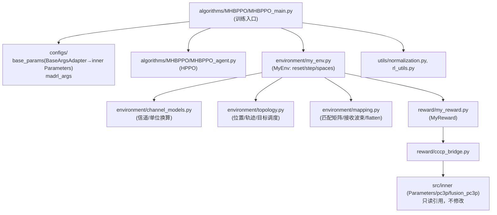

## User Requirements

将 `src/outer_old` 中 **MHBPPO 这一条链路**（算法 + 环境 + 奖励 + 工具）重构并迁移到空目录 `src/outer` 下，形成工程化的新外层代码。硬约束：

- 不得修改 `src/outer_old/` 与 `src/inner/` 下任何文件，只能参考其写法。
- 原实现的**数值逻辑、公式、动作空间、观测拼接顺序、奖励口径必须完全一致**，只允许改动：参数来源、函数归属（搬移）、import/路径。
- 迁移范围（已确认）：`algorithms/MHBPPO`（agent + main）、`environment/my_env.py`、`reward/my_reward.py` + `reward/cccp_bridge.py`、`utils/*`；`diff_settings/*` 暂不迁移。
- 目录结构（已确认）：按模块分层 `src/outer/{configs, algorithms/MHBPPO, environment, reward, utils}`。

## Product Overview

一个可运行的外层 MADRL（MHBPPO/PPO）代码工程：以 `src/inner/parameters.py` 的 `Parameters` 作为**唯一的场景基础参数来源**，通过适配层向环境/奖励暴露旧字段名；环境中的信道/拓扑/映射等通用计算被拆分为独立语义模块；算法、环境、奖励、工具各自分层存放，便于后续扩展其它外层算法与复用。

## Core Features

- **统一参数来源**：用 inner `Parameters` 替换自带的 `get_base_args`；新增参数适配层（映射旧字段名 + 补齐 inner 缺失字段），`madrl_args` 抽到 `configs/` 单独存放。
- **环境职责拆分**：把 `my_env.py` 中与 env 无关的计算按语义抽离——信道计算、位置/轨迹/目标调度（拓扑）、匹配矩阵/接收波束（映射）；`MyEnv` 只保留环境状态机、动作/观测空间与 reset/step。
- **最小改动迁移**：agent、utils、reward、cccp_bridge 基本原样迁移；仅补参数来源与 import/路径调整。
- **可运行性与安全性**：import/路径解析正确，`outer_old`、`inner` 保持零改动，保留原有训练入口与产物（csv、pth、tensorboard）行为。

## Tech Stack

- 语言/运行时：Python 3（沿用现有工程）
- 依赖：NumPy（数值/向量化）、PyTorch（PPO Actor-Critic）、gym/gymnasium（外层环境接口）、tqdm、pandas、tensorboard、matplotlib（沿用现有）
- 内层求解：MOSEK Fusion 后端（`src/inner/fusion_pc3p.py`，经 `cccp_bridge` 调用），本次不改动
- 参数来源：`src/inner/parameters.py` 的 `Parameters`（dataclass，`__post_init__` 派生 `rho_ref/kappa_rician/sigma_2/P_max_uav/P_max_cu/eps_sinr/xi_1/xi_2/tau_scale/...`）

## Implementation Approach

整体策略：**同构搬运 + 一层适配**。新 `outer/` 与 `outer_old/` 保持相同的包层级（`algorithms/`、`environment/`、`reward/`、`utils/`），因此 `MHBPPO_main.py` 顶部"向上查找含 `algorithms` 的目录"逻辑与 `from algorithms.../environment.../utils...` 导入**无需改动**；`cccp_bridge.py` 位于 `outer/reward/`，其 `_SRC_DIR = dirname(dirname(__file__)) = src`、`_INNER_DIR = src/inner` 与原深度一致，同样无需改动。

关键决策：

1. **参数适配层（BaseArgsAdapter）**：`configs/base_params.py` 内构造单个 `Parameters` 实例并包装，`__getattr__` 按映射表把旧字段名（`uavs_num/cus_num/targets_num/radius/antenna_nums/frac_d_lambda/alpha_uav_link/alpha_cu_link/radar_rcs/sen_sinr/...`）解析到 inner 原生字段（`I/J/K/deploy_radius/N/d_over_lambda/alpha_1/alpha_3/xi_0/eps_sinr_db/...`）；对 inner 缺失字段（`z_scale`、`markov_*`、`center`）以实例属性补齐。这样 env/reward 副本**几乎零逻辑改动**即可运行（最小改动原则）。

- 为什么不用"直接改 env/reward 用 inner 字段名"：会大范围改动已确认可跑通的 env/reward 代码，违背最小改动与"只参考写法"的约束。
- `setattr` 透传到底层 `Parameters`（若字段存在）否则写入扩展字典，兼容潜在的字段覆盖。

2. **参数模块命名**：适配层模块**不得**命名为 `parameters.py`——内层 `cccp_bridge` 会 `from parameters import Parameters`，同名会污染。命名为 `configs/base_params.py`；如需极致稳健，用 `importlib` 以别名按文件路径加载 inner `parameters.py`（与 `cccp_bridge` 加载 inner `environment.py` 的做法一致）。
3. **环境函数抽离**：纯代码搬移（signature 尽量不变），`MyEnv` 通过 `from environment.channel_models import ...` 等调用，行为与耗时不变（信道计算仍是 NumPy 向量化）。
4. **口径变化提示（有意为之）**：基础参数改由 inner `Parameters` 提供后，部分默认值会变化（如 `uav_height 100→50`、`antenna_nums(N) 6→10`、`radar_rcs(xi_0) 10→0.1`、`sen_sinr(eps_sinr_db) 20→5`），这是"统一到 inner 场景定义"的预期结果；数值公式本身不变。

## Implementation Notes

- **路径/导入一致性**：`environment` 包与 `inner/environment.py` 同名，`cccp_bridge` 已用 `importlib` 别名 `_iscc_inner_environment` 规避；新增 `configs/` 不要产生与 inner 同名的顶层模块（`parameters/variables/pc3p/fusion_pc3p/cccp_params`）。
- **奖励口径必须锁定**：`my_reward.py` 的 `exp(-energy_opt/1000)`、四类惩罚项、`flight/sensing/offloading/computation` 能耗分解公式，以及 `solution_payload["auxiliary_variable_z"]` 的 `z_scale` 归一化约定，全部保持原样；适配层必须提供 `z_scale`（否则 `my_reward` 第 91 行会 `AttributeError`）。
- **`uav_max_power` 语义**：`cccp_bridge` 会对其做 `_watt_2_dbm`，因此适配层应返回**线性 W**（取 `Parameters.P_max_uav`，由 `P_max_uav_dbm=40` 派生）。
- **`alpha_uav_link`**：旧实现 UAV-CU 与 UAV-BS 同指数；适配层返回 `params.alpha_1`，从而 `cccp_bridge` 的 `alpha_1/alpha_2` 保持一致，行为不变。
- **保留调试输出**：`MyEnv.step()` 的彩色 `print` 日志与 `success` 判定链路保持原样（属于既有行为，不因重构删除）。
- **产物路径**：`runs/beta-hppo/...`、训练 csv、`*_mhbppo_*.pth` 输出沿用原写法，避免引入行为差异。
- **零回归保障**：全程不触碰 `outer_old/`、`inner/`；完成后用 `git status` 确认这两个目录无改动。
- **性能**：搬移为纯代码位移，无新增热路径；适配层 `__getattr__` 为 O(1) 字典查表，忽略不计。

## Architecture Design



数据流保持原样：`env.reset()` → 观测(bs) → `agent.choose_action` → `env.step({"bs": action})` → 内部 `MyReward.reward_compute` → `cccp_bridge.solve_inner_energy`（内层 MOSEK 求解）→ 奖励/能耗 → `agent.update`。

## Directory Structure

```
src/outer/
├── configs/
│   ├── __init__.py            # [NEW] 配置包标识（可选空文件）
│   ├── base_params.py         # [NEW] 基础参数来源与适配层。加载 inner/parameters.py 的 Parameters（建议 importlib 别名加载，避免与 inner 顶层名 parameters 冲突）；实现 BaseArgsAdapter：用映射表把旧字段名(uavs_num/cus_num/targets_num/radius/antenna_nums/frac_d_lambda/alpha_uav_link/alpha_cu_link/radar_rcs/sen_sinr/radar_duty_ratio/var_range_fluctuation/radar_impulse_duration/radar_spectrum_shape/uav_sen_duration/bs_cycles_per_bit/bs_max_freq/kappa/uav_c1/uav_c2/bandwidth/noise_power_density_dbm/cu_max_power_dbm/uav_max_power(线性W)/cu_max_delay/uav_max_delay/time_slot_duration/omega_weight_1..3/seed)解析到 inner 字段，并补齐 z_scale(=1e5)、center(=[0,0])、markov_velocity/markov_memory_level/markov_asymptotic_mean_of_velocity/markov_standard_deviation_of_velocity(沿用旧默认)；提供 setattr 透传；导出 get_base_args() 供 main 调用。
│   └── madrl_args.py          # [NEW] 从 MHBPPO_main.py 抽离的 get_madrl_args()（actor_lr/critic_lr/lmbda/eps/gamma/epochs/total_time_slots/hidden_dim/episodes），逻辑与默认值保持原样。
├── algorithms/
│   └── MHBPPO/
│       ├── MHBPPO_agent.py    # [NEW] 原样复制自 outer_old（HPPO/MultiHeadActor/Critic/BetaHead/GaussianHead），无 args 依赖，不做逻辑改动。
│       └── MHBPPO_main.py     # [NEW] 迁移训练入口：删除自带 get_base_args/get_madrl_args，改为 from configs.base_params import get_base_args、from configs.madrl_args import get_madrl_args；保留 sys.path 自动定位、setSeed、训练循环、csv/pth/tensorboard 输出逻辑不变。
├── environment/
│   ├── __init__.py            # [NEW] 环境包标识（可选空文件）
│   ├── my_env.py              # [NEW] MyEnv(gym.Env)：保留 t/位置状态、动作/观测空间(low/high 顺序与 obs_dim 公式不变)、reset/step、getPosXxx、_refresh_channels/_precompute_nlos_components、_build_bs_observation 与观测辅助；改为从 channel_models/topology/mapping 导入被抽离函数；step 的日志与 success 判定原样保留。
│   ├── channel_models.py      # [NEW] 信道与单位换算：db_2_watt、dbm_2_watt、compute_com_channel_gain（含嵌套 get_rician_channel，MIMO/非MIMO Rician + 预生成 NLoS 复用）、compute_sen_channel_gain。函数签名与原实现一致，仅搬移。
│   ├── topology.py            # [NEW] 位置/轨迹/目标调度：generate_pos、generate_cu_trajectory(Markov)、generate_uav_target_schedule、_assign_targets_for_window、_get_num_target_windows、_validate_target_schedule_requirements、_print_precomputed_target_schedule。签名尽量保持；对 base_args 的依赖参数由调用方显式传入或接收 base_args。
│   └── mapping.py             # [NEW] 匹配矩阵/波束/扁平化：build_uav_targets_matched_matrix、build_uavs_cus_matched_matrix、build_unit_norm_rec_beam(单位范数接收波束)、flatten_complex。签名保持，纯函数化。
├── reward/
│   ├── __init__.py            # [NEW] 奖励包标识（可选空文件）
│   ├── my_reward.py           # [NEW] 原样迁移 MyReward：保留 sys.path 注入 + from cccp_bridge import solve_inner_energy as penalty_based_cccp；奖励公式/能耗分解/返回结构完全不变；仅依赖适配层提供的字段（含 z_scale/radius 等）。
│   └── cccp_bridge.py         # [NEW] 原样迁移：_SRC_DIR/_INNER_DIR 相对深度不变（→src/inner），importlib 别名加载 inner environment，build_inner_parameters 与 solve_inner_energy 逻辑不变；适配层对象的旧字段名可被其 _pick/getattr 正常读取。
└── utils/
    ├── __init__.py            # [NEW] 工具包标识（可选空文件）
    ├── normalization.py       # [NEW] 原样复制 RunningNorm/RunningMeanStd/RewardScaling/Normalization。
    └── rl_utils.py            # [NEW] 原样复制 ReplayBuffer/moving_average/train_on_policy_agent/train_off_policy_agent/compute_advantage。
```

## Agent Extensions

### Skill

- **lsp-code-analysis**
- Purpose: 在抽离 env 函数时，用语义化导航（find references / call hierarchy / outline）确认 `compute_com_channel_gain`、`compute_sen_channel_gain`、`generate_pos`、`generate_cu_trajectory`、目标调度与匹配矩阵等函数的**全部调用点与定义**，避免搬移后漏改调用或残留悬空引用。
- Expected outcome: 得到完整的"被搬移符号 → 调用点"清单，保证 `MyEnv` 内调用全部切换到新模块，且没有遗漏。

### SubAgent

- **code-explorer**
- Purpose: 跨文件核查迁移后的 import/路径链路与命名冲突风险（`environment` 包 vs `inner/environment.py`、`parameters` 顶层名冲突、`cccp_bridge` 的 `_INNER_DIR` 深度），并确认 `outer_old/`、`inner/` 未被改动。
- Expected outcome: 输出一份 import/路径与依赖一致性核查结论，确认新 `outer/` 可正确解析模块、无命名冲突、原目录零改动。